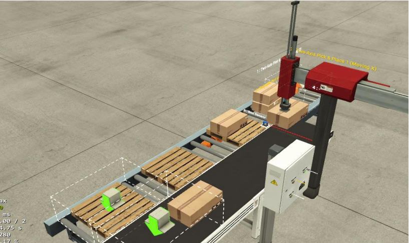
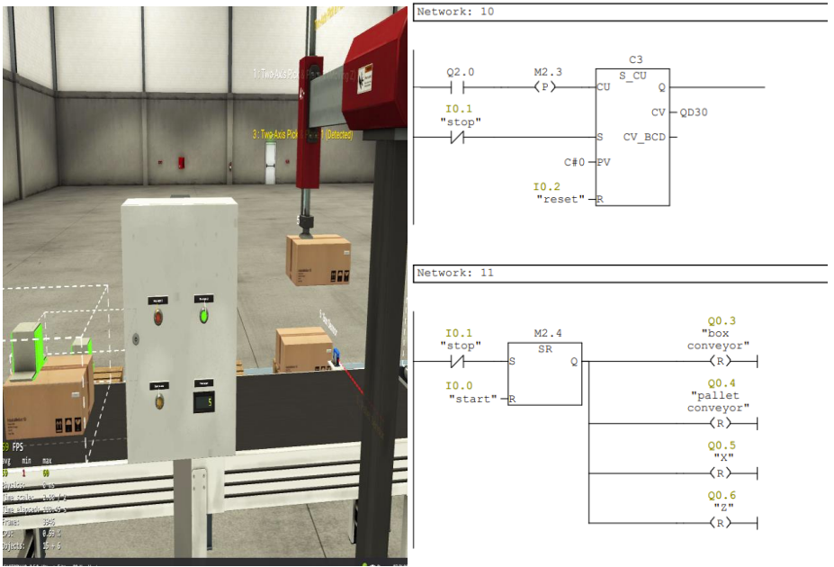

# Palletizing System Using Conveyor Belts and PLC

This project simulates a palletizing system using **Factory IO** and **PLC**, featuring two conveyor belts, a Pick & Place robot, and multiple sensors for automation. The system is designed to stack boxes onto pallets with precise control and coordination.

---

## **System Overview**

1. **Conveyor Box**:  
   - Produces and transports boxes to the end of the conveyor.  
   - Stops when the box reaches the limit switch, positioning it under the robot.

2. **Pick & Place Robot**:  
   - Moves the box from the first conveyor to the pallet on the second conveyor.  
   - The process includes the following steps:
     - Activating the robot's Z-axis to lower the end effector (EE).  
     - Detecting the box using sensors and enabling the suction motor (grab).  
     - Resetting the Z-axis and moving the X-axis to transfer the box to the pallet.  
     - Placing the box on the pallet and releasing it by turning off the grab.  

3. **Conveyor Pallet**:  
   - Produces pallets and transports them to the loading area.  
   - Stops when the pallet reaches the designated position under the robot.  

4. **Palletizing Process**:  
   - Two boxes are placed on a single pallet before the pallet is moved for loading.  
   - After placing the second box, the second conveyor resumes operation to transport the pallet.  

5. **Counters and Display**:  
   - A counter tracks the number of boxes placed on a pallet.  
   - Another counter records the total number of pallets transported, which is displayed in Factory IO.  

---

## **Control Features**

- **Start/Stop Buttons**:  
  Control the overall operation of the system.  

- **Reset Functionality**:  
  All components and timers are reset when the Stop button is pressed.  

- **Delay Mechanisms**:  
  Timers are used to ensure smooth transitions between steps, preventing imbalance during box transfer.
  
---
## **Key Notes**

- The system ensures accurate placement of boxes on pallets with step-by-step delays for stability.  
- Sensors can be repositioned, but conveyor belts must remain stationary.  

---

This project demonstrates fundamental industrial automation concepts, combining precise robot control with conveyor-based transport, making it a practical use case for learning PLC programming and Factory IO simulation.
